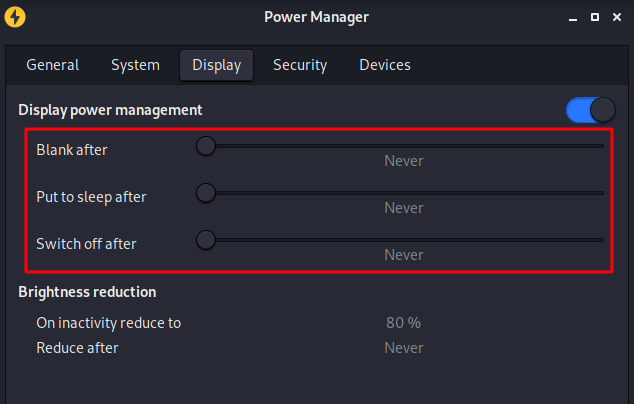
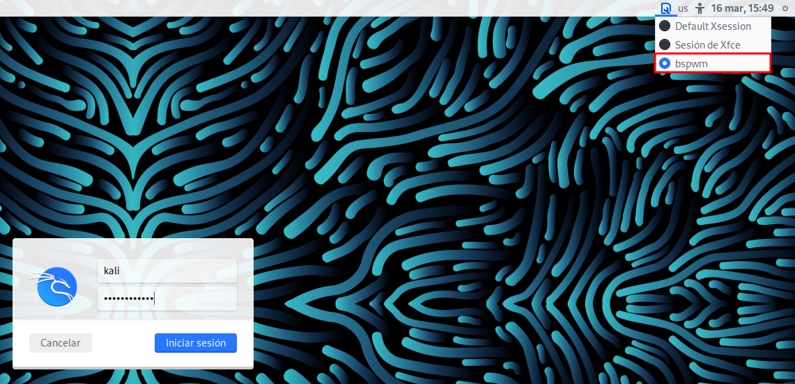
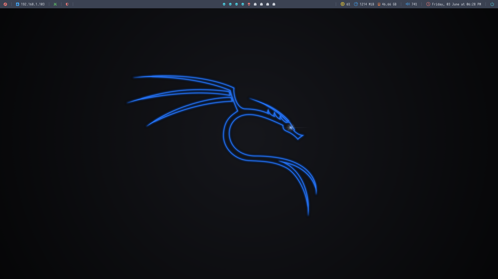

# kali-bspwm
> This is a bash script that install all the  you need to use [Kali Linux ](https://www.kali.org/) with a tiling window manager like [bspwm](https://github.com/baskerville/bspwm).

## Installation
1. Make sure to disable sleep because the script can take a while to finish



2. Clone this repository and change the directory

```bash
git clone https://github.com/RaulSanchezzt/kali-bspmw.git && cd kali-bspwm
```

3. Give the current user execute permissions

```bash
chmod +x setup.sh
```

4. Run the script

```bash
./setup.sh
```

5. Make sure you have your `dotfiles` configured. In this case, I will download my personal  [dotfiles](https://github.com/RaulSanchezzt/dotfiles).

```bash
git clone https://github.com/RaulSanchezzt/dotfiles.git ~/dotfiles && cd ~/dotfiles 
```

6. Create the necessary symbolic links

```bash
./link.sh
```

8. Reboot the machine

```bash
sudo reboot now
```

9. Once you have rebooted the machine, select `bspwm` as the window manager and then login.



10. This will be the final result. Start a new terminal using `Super + Intro`



## How to update Nvim v0.61 to Nvim v0.7.0 in Kali Linux

> Once you have installed Kali Linux, you may have installed `Nvim` v0.61 by default. If you would like to use a custom configuration like [NvChad](https://github.com/NvChad/NvChad) you will have to update `Nvim` this way.

1. Check if your version is under v0.7.0
```bash
nvim --version
NVIM v0.6.1
Build type: Release
LuaJIT 2.1.0-beta3
Compiled by team+vim@tracker.debian.org

Features: +acl +iconv +tui
See ":help feature-compile"

     system "vimrc" file: "$VIM/sysinit.vim"
            fall-back for $VIM: "/usr/share/nvim"

Run :checkhealth for more info
```

2. Download the latest version from the official source

```bash
wget https://github.com/neovim/neovim/releases/download/v0.7.2/nvim-linux64.deb
```

3. Make sure you have the system updated

```bash
sudo apt update && sudo apt upgrade
```

4. Delete `nvim.desktop` of your PC

```bash
sudo rm /usr/share/applications/nvim.desktop
```

5. Remove `neovim` and It's componentes of your computer

```bash
sudo apt remove neovim neovim-runtime
```

```bash
sudo apt autoremove
```

6. Then, install the new version of `nvim`

```bash
sudo apt install ./nvim-linux64.deb
```

7. After having installed the new version, check the version again

```bash
NVIM v0.7.2
Build type: Release
LuaJIT 2.1.0-beta3
Compiled by runner@fv-az164-457

Features: +acl +iconv +tui
See ":help feature-compile"

   system vimrc file: "$VIM/sysinit.vim"
  fall-back for $VIM: "/share/nvim"

Run :checkhealth for more info
```

8. Finally, create a symbolic link to use `vim` as `nvim`

```bash
sudo ln -sf /usr/bin/nvim /usr/bin/vim
```

## References
> If you want learn more about it, check out this repositories.
- Other configurations
    - https://github.com/nozerobit/colorful-kali
    - https://github.com/yorkox0/autoBspwm
    - https://github.com/yorkox0/autoAwesome
    - https://github.com/yorkox0/autoBspwm.sh
- Tools
    - https://github.com/baskerville/bspwm
    - https://github.com/baskerville/sxhkd
    - https://polybar.github.io/
    - https://github.com/yshui/picom
    - https://github.com/davatorium/rofi
    - https://github.com/kovidgoyal/kitty
    - https://github.com/neovim/neovim
    - https://www.nerdfonts.com/
    - https://github.com/sharkdp/bat
    - https://github.com/Peltoche/lsd
    - https://github.com/radareorg/radare2